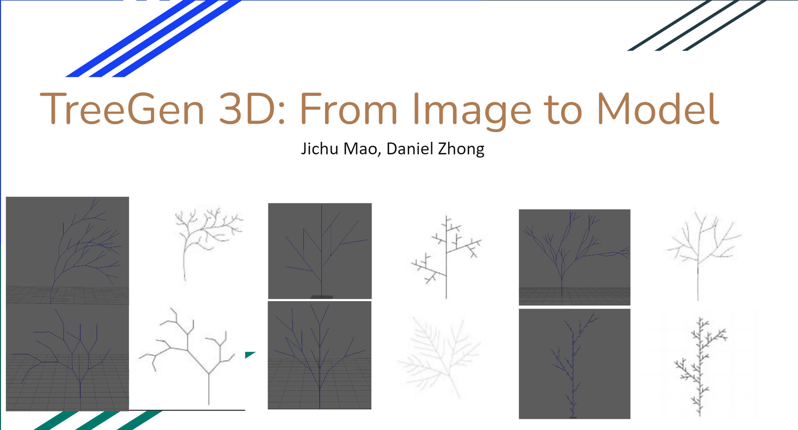
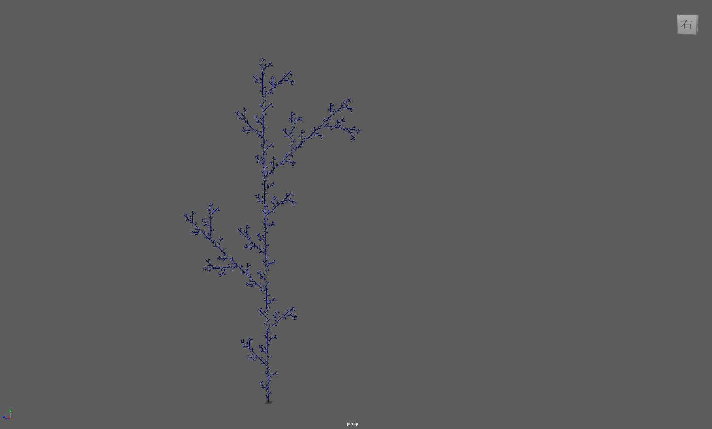
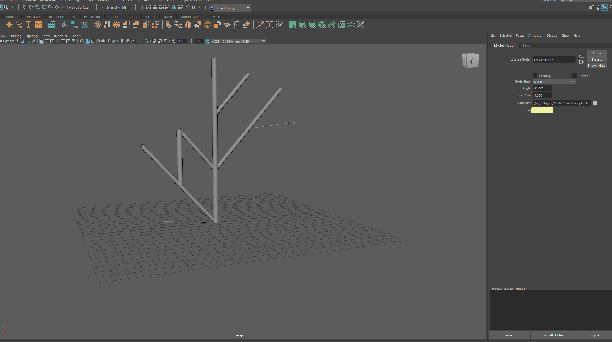
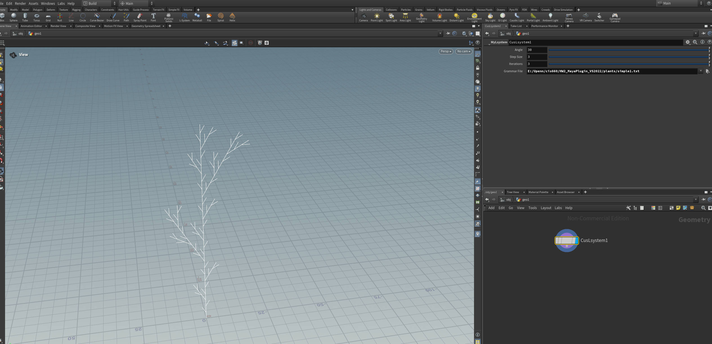
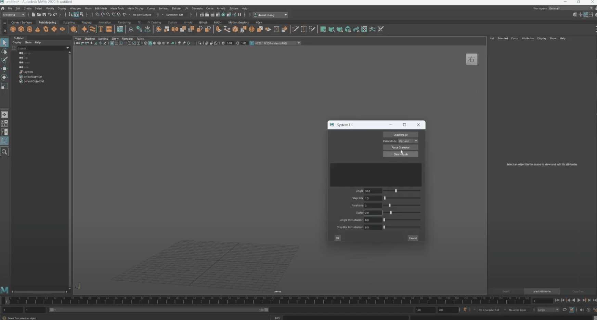
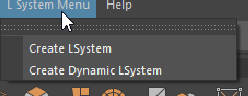
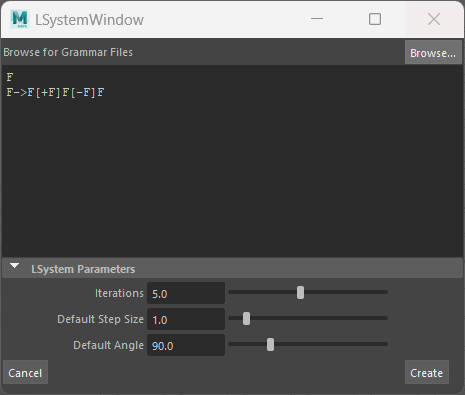
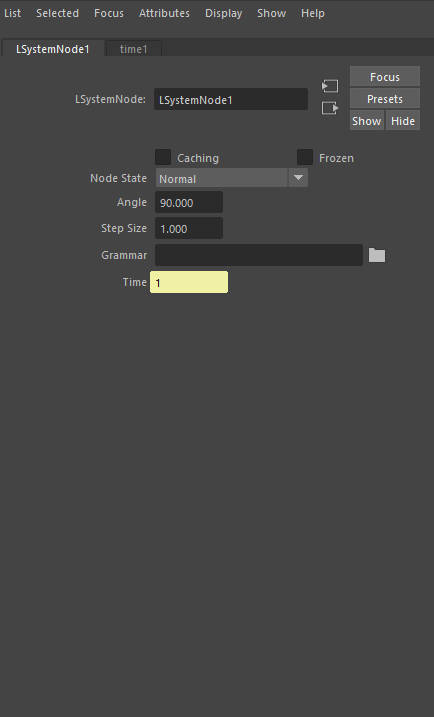
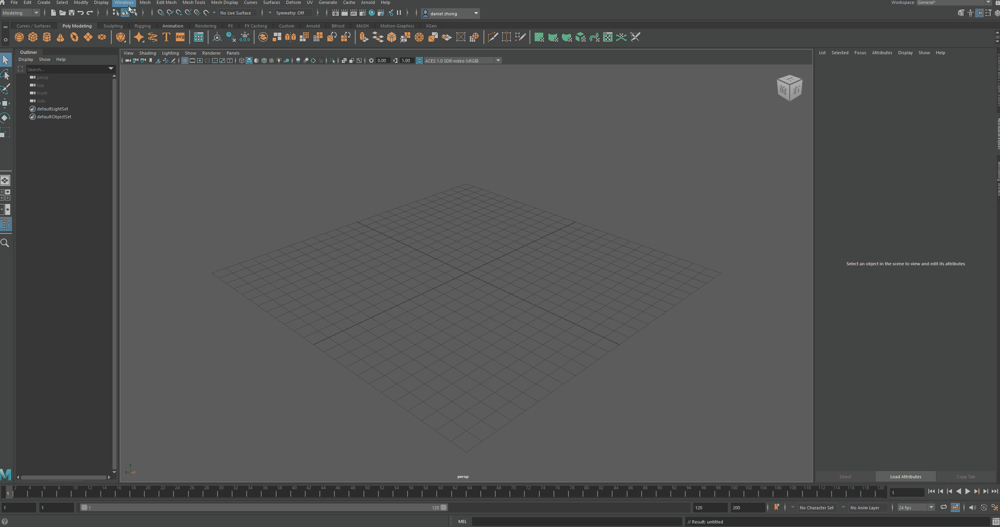
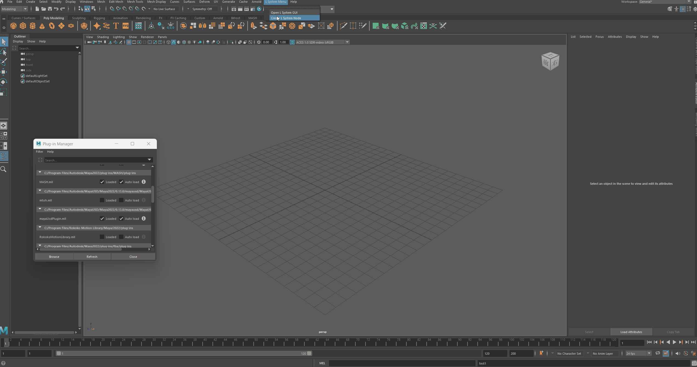

# MAYA & Houdini Plugin - L System (C++, Python, Mel scripts)

* Ruijun(Daniel) Zhong
    * [LinkedIn](https://www.linkedin.com/in/daniel-z-73158b152/)    
    * [Personal Website](https://www.danielzhongportfolio.com/)
* Tested on: 
  * Core(TM) i7-12700K 3.61 GHz 32.0 GB, NVIDIA GeForce RTX 3070 Ti (personal computer)   
    * Maya 2022, Houdini 20.0.590, Visua Studio 2022

||||||
|:-:|:-:|:-:|:-:|:-:|
|C++ MAYA|C++ MAYA|Python MAYA|Python MAYA|C++ Houdini|

# Introduction - [Click here for demo video](https://drive.google.com/file/d/1OH2sSOqizYg5KCI9NO3c3pnWZSNkGsCU/view?usp=sharing)

This project explores the development of plugins for both Autodesk Maya and SideFX Houdini to integrate L-Systems, a mathematical modeling language used to simulate the growth processes of plant development and other naturally occurring phenomena. The plugins are developed using C++, Maya Embedded Language (MEL), and Python for Maya, while focusing on C++ for Houdini.

We have implemented the methodology described in the [IPML SIGGRAPH paper](https://vcc.tech/research/2020/IPML)
, which employs neural networks to detect L-System patterns from 2D images and convert them into grammar rules for generating corresponding 3D shapes in Maya. This project enables a workflow where users can seamlessly convert 2D images into 3D shapes without dealing with complex grammar rules, while also allowing for real-time shape adjustments.

The core objective of this project is to provide users with tools to generate and visualize complex organic structures through the procedural generation capabilities of L-Systems. By leveraging the powerful APIs of Maya and Houdini, this project adds custom commands and nodes, enabling the efficient creation of intricate plant models and other fractal-like structures. This workflow aims to save users time and provide a more intuitive way to generate L-System trees and other similar structures.

# Plugin Demo
  

||||
|:-:|:-:|:-:|
|Menu|GUI|Node Interface|

## Loading Plugin in Houdini

## Loading Plugin in Maya

